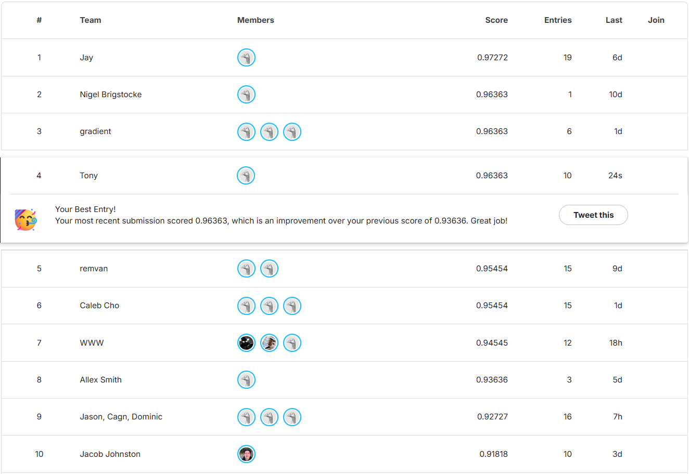
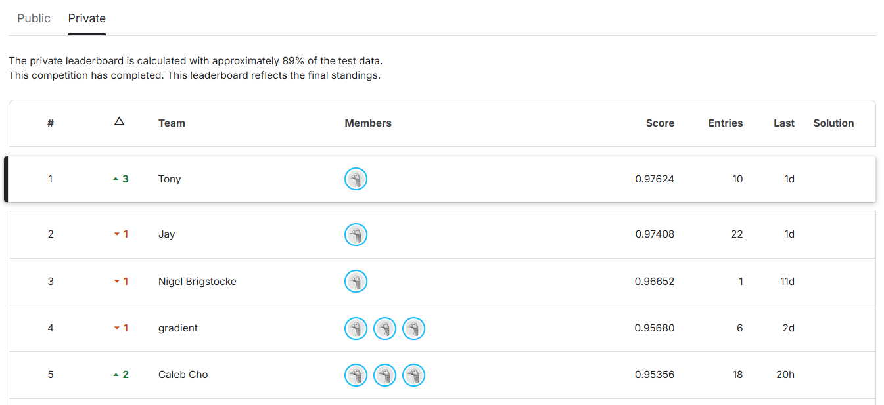

# SigLIP-2 Blend Classifier

100-class image classification (~10 training images/class, imbalanced: 4-41 per class) for a
Kaggle transfer-learning task. The deployed model is a two-branch blend: a frozen branch of
SigLIP-2 logistic-regression probes plus text zero-shot members (over two larger HuggingFace
SigLIP-2 checkpoints) blended with a single LoRA-fine-tuned SigLIP-2 SO400M backbone. It reaches
OOF 0.9676 (cross-validation) / public LB 0.96363.

This started as a frozen-feature probe and grew through several approaches (frozen multi-view,
a frozen cross-backbone ensemble, a fine-tuned LoRA ensemble) before landing on a single
fine-tuned backbone, which is now branch B of the final blend. The earlier pipelines are
preserved under `src/deprecated/` as a record of the journey; see `docs/architecture.md` and the
report for the full story.

See `docs/spec.md` for the assignment and `src/README.md` for the module layout. The
project report is at `docs/CSE144_Final_Report.pdf`.

## Acronyms

- OOF - out-of-fold (cross-validation) accuracy: each training image is scored only by the
  fold models that did not see it during training.
- LB - the Kaggle public leaderboard score (estimated on about 10% of the test set).
- CV - cross-validation.
- TTA - test-time augmentation: average the prediction over several views of each test image
  (identity + horizontal flip). Tested and dropped for the deploy (it cost ~1 image).
- LoRA - low-rank adaptation: fine-tune a few low-rank matrices inside the frozen backbone.
- probe - a lightweight linear classifier trained on frozen features (the earlier approach).

## Deployed model

A two-branch blend. Branch A (frozen) runs two HuggingFace SigLIP-2 checkpoints,
`google/siglip2-giant-opt-patch16-384` ("gopt-384") and
`google/siglip2-so400m-patch16-512` ("so400m-512"); each contributes a logistic-regression probe
(on L2-normalized shared-space image embeddings, trained per-fold on the shared seed-42 folds)
and a text zero-shot member (class-name prompts through the text tower, softmax over scaled
image-text cosine logits, no training). Branch B (existing) is the LoRA fine-tuned SigLIP-2 fold
ensemble, reloaded from its saved bundle with no retraining. A margin-gated simplex grid search
(step 0.1, margin 0.003, equal-weight fallback) over the five OOF probability matrices sets the
tuned weights, which are then applied to the test matrices and argmaxed.

| member | OOF | weight |
| --- | --- | --- |
| probe_gopt384 | 0.9509 | 0.6 |
| text_gopt384 | 0.8693 | 0.1 |
| probe_so400m512 | 0.9472 | 0.1 |
| text_so400m512 | 0.8981 | 0.0 |
| finetuned_siglip2 (branch B) | 0.9490 | 0.2 |

| metric | value |
| --- | --- |
| blend OOF | 0.9676 |
| public LB | 0.96363 |
| branch-B fine-tune (standalone) | OOF 0.9484 +/- 0.0004 / LB 0.93636; 12 fine-tunes |

Equal-weight blend OOF is 0.9500; the tuned blend reaches 0.9676 (+2.73 LB points over the prior
best 0.93636). No test images are used for training anything (the spec restricts training to the
train directory; in particular we did not use test-set pseudo-labeling).

## Kaggle leaderboard

Public leaderboard position for the deployed submission (score 0.96363 on 11% of the test data):



Final Private leaderboard position for the deployed submission (score 0.97624 on 89% of the test data):



Design and rationale: `docs/architecture.md`.

## Run the deployed blend

One command builds the two-branch blend and writes the deployed submission:

```bash
python -m src.final_blend
```

Prerequisite: `outputs/single_ft/single_ft_bundle.pkl` must exist (train it with
`python -m src.single_ft`, or download it from the Google Drive link in the "Trained weights"
section below). Branch A's HF checkpoints (~7 GB) download from Hugging Face on first run. It
writes:

- `outputs/submission_blend.csv` - the deployed predictions (columns `ID,Label`, one row per
  test image). `outputs/submission.csv` is a copy of this file (the Kaggle upload).
- `outputs/final_blend/blend_bundle.pkl` - the probe fold models, tuned weights, and class names.
- `outputs/final_blend/metrics.json`, `metadata.json` - member OOF scores, the tuned weights, the
  blend OOF, and provenance (git SHA + library versions).
- `outputs/cache/hf_gopt384.npz`, `hf_so400m512.npz` - cached HF embeddings keyed by a prompt
  hash; reruns skip the HF models entirely (~13 min first run -> ~3 min cached on the 5070 Ti).

`src/data/class_names.csv` holds the 100 class names, derived by viewing 1-2 training images per
class (Claude vision); the text members need them. This also identified the dataset composition:
classes 0-24 are Food-101 dishes, 25-49 Oxford Flowers-102, 50-74 Stanford Cars, 75-99
FGVC-Aircraft (quarters).

## Run branch B alone (the fine-tuned backbone)

One command trains branch B and writes its standalone submission:

```bash
python -m src.single_ft
```

Reads `config.yaml` (the `single_ft` block), runs the 3-seed shared-fold OOF, trains the
seed-42 4-fold ensemble, and writes:

- `outputs/submission_siglip2.csv` - branch B's predictions (columns `ID,Label`, one row per
  test image).
- `outputs/single_ft/single_ft_bundle.pkl` - the LoRA adapters + cosine heads (the trained
  weights, also the prerequisite for the blend).
- `outputs/single_ft/metrics.json`, `metadata.json` - OOF scores, the TTA-vs-identity
  comparison, and provenance (git SHA + library versions).

## Run inference only (branch B, with the provided weights)

To run branch B inference with the trained model instead of retraining, download
`single_ft_bundle.pkl` from the Google Drive link in the "Trained weights" section below,
place it at `outputs/single_ft/single_ft_bundle.pkl`, and run:

```bash
python -m src.single_ft predict
```

This loads the bundle (the 4 fold models: LoRA adapters + cosine heads), softmax-ensembles
them over `data/test/`, and writes `outputs/submission_siglip2.csv` - no training involved.
The frozen SigLIP-2 base weights are fetched from the timm hub on first run.

## Earlier approaches

The journey steps below. The `deprecated/` pipelines are preserved for documentation, not the
deployed model; the single fine-tuned SigLIP-2 is NOT deprecated (it is branch B of the deployed
blend). Run from the repo root:

| approach | entry point | OOF / LB |
| --- | --- | --- |
| Single-backbone frozen probe | `python -m src.deprecated.train` (with `train_aug_views: 1`) then `python -m src.deprecated.predict` | 0.8851 / ~0.88 |
| Multi-view K=8 frozen probe | `python -m src.deprecated.train` (default config) then `python -m src.deprecated.predict` | 0.9129 / 0.90000 |
| Frozen cross-backbone ensemble | `python -m src.deprecated.ensemble` | 0.9314 / 0.91818 |
| Fine-tuned LoRA ensemble (3 backbones) | `python -m src.deprecated.ensemble_ft` | 0.9404 / 0.93636 |
| Single fine-tuned SigLIP-2 (branch B) | `python -m src.single_ft` | 0.9484 / 0.93636 |

The single fine-tuned SigLIP-2 matches the LoRA ensemble's LB and beats its OOF while training
3x fewer models; it was the deploy until the two-branch blend superseded it, and it now serves as
branch B of that blend.

## Setup

Requires a CUDA 12.8 PyTorch build for the Blackwell GPU (RTX 50-series). Verified working with
Python 3.14.0 and torch 2.9.0+cu128 on an RTX 5070 Ti (16 GB). CPU works but is slow. The blend
also requires transformers 5.9.0 (now in `requirements.txt`); its two HuggingFace SigLIP-2
checkpoints (~7 GB) download from Hugging Face on the first run of `src.final_blend`.

```bash
python -m venv .venv
.venv\Scripts\activate   # windows. use source .venv/bin/activate on linux/mac
pip install -r requirements.txt
python -c "import torch; print(torch.cuda.is_available())"   # expect True on gpu
```

Run everything from the repo root. Do not run `pytest` from inside `data/` (a stray
`data/train/.pytest_cache` would be read as a class folder).

## Data layout

```
data/
  train/<class>/<n>.jpg   # 100 classes, 1079 images total (imbalanced, 4-41 per class)
  test/<id>.jpg           # 1036 test images, every one is a scored row
  sample_submission.csv   # template for the ID,Label format
```

## Reproducibility

- Fixed seed (`config.yaml: seed`) across `random`, NumPy, and PyTorch; deterministic cuDNN
  and `torch.use_deterministic_algorithms(True, warn_only=True)`.
- The deploy reports a 3-seed (42/43/44) shared-fold OOF mean +/- std. Some bf16 attention ops
  are non-deterministic, so per-seed OOF can drift ~0.2-0.3 pt and may drift more across
  different torch/CUDA/GPU versions.
- `outputs/single_ft/metadata.json` records the git SHA and exact torch/timm/scikit-learn/CUDA
  versions.

## Tests

```bash
pytest -q
```

74 tests cover labels, data listing, submission validation, the probe head, LoRA building blocks
(cosine head, class-balanced weights, TTA eval), the shared fold helpers, the single_ft
orchestrator, the final-blend members (text zero-shot softmax, probe fold alignment, class-names
csv validity), and the deprecated pipelines (multi-view grouped CV, Sinkhorn, fusion, ensemble).
The LoRA tests need `timm`/`peft`, so use the project venv.

## Diagrams

`docs/diagrams/deploy.svg` is a high-level view of the deployed model:


The earlier, denser d2 pipeline diagrams are archived under `docs/archive/diagrams/` as a
historical record; they document the now-deprecated pipelines. The deployed model's full design
is in `docs/architecture.md`.

## Trained weights

All trained artifacts are in the Google Drive folder:
<https://drive.google.com/drive/folders/1lwJDvojOuGGkg6LzjTb1yeAWtgNKBdxr?usp=sharing>

- `single_ft_bundle.pkl` - the branch-B bundle (LoRA adapters + cosine heads); place it at
  `outputs/single_ft/single_ft_bundle.pkl`.
- `blend_bundle.pkl` - the blend artifacts (probe fold models, tuned weights, class names);
  place it at `outputs/final_blend/blend_bundle.pkl`.
- `hf_gopt384.npz`, `hf_so400m512.npz` - the cached branch-A embeddings; place them under
  `outputs/cache/` to skip the HF feature extraction on a rerun.

The branch-B bundle is also available as a direct link:
<https://drive.google.com/file/d/1dM5c--xErWO10DqBSsWrvLaogzZ20Sjd/view?usp=sharing>.
