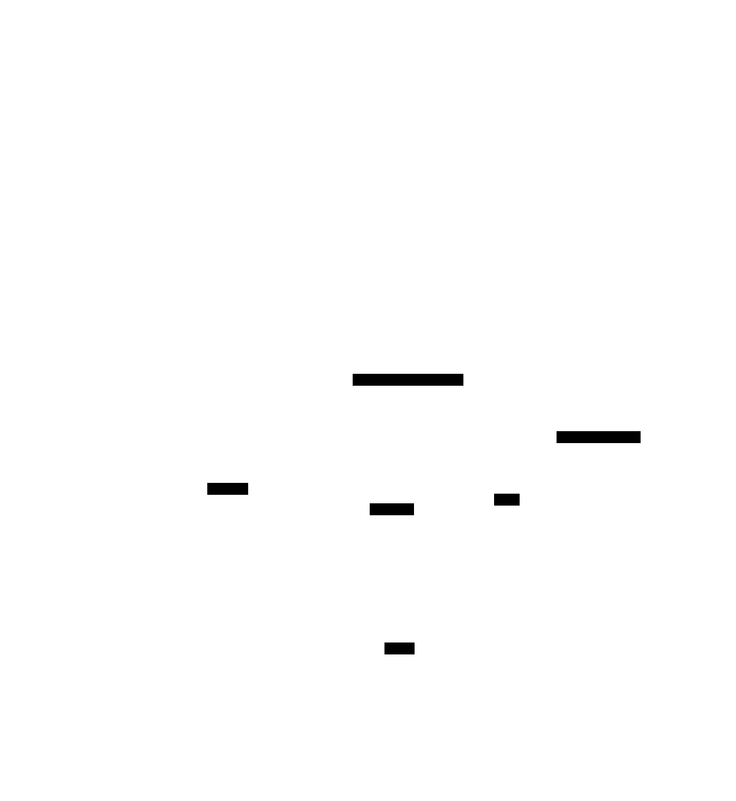

# Architecture

This document distills the design behind the DINOv3 frozen-feature classifier and links the
data-flow diagrams. For the full rationale and experiment history see the local design docs
under `docs/flow/specs/` and `docs/flow/plans/` (gitignored), and the research notes in
`docs/` (`improving-89-baseline.md`, `dinov3-research.md`, `model-choice-research.md`).

## Acronyms

- OOF - out-of-fold (cross-validation) accuracy: each training image is scored only by the
  fold models that did not see it during training.
- LB - the Kaggle public leaderboard score (estimated on about 10% of the test set).
- CV - cross-validation.
- TTA - test-time augmentation: average the prediction over several views of each test image
  (here identity + horizontal flip).
- CLS - the transformer "class" token, a per-image summary token.
- gap - global average pooling (how SigLIP-2 produces its pooled embedding).
- LoRA - low-rank adaptation, the experimental fine-tuning path.
- probe - the lightweight linear classifier (logistic regression) trained on frozen features.

## Overview

The task is 100-class classification with only ~10 (4-41) training images per class. Full
fine-tuning of a large vision transformer would overfit and is slow, so the design freezes a
strong pretrained backbone and trains only a lightweight linear probe on its features. This
gives fast convergence, deterministic training, and strong accuracy from limited data. Three
pipelines build on that core, from a single backbone to a multi-backbone ensemble.

The module layering (arrows mean "imports from"):

Entry points (`train`, `predict`, `ensemble`, `lora_train`) orchestrate; `src/models`
holds the logic (backbone embedding, the probe head, multi-view grouped CV, fusion,
Sinkhorn balancing); `src/data`, `src/utils`, and `src/submission` are the foundation.

## Pipeline 1: single-backbone frozen probe

One frozen backbone produces a feature per image; the cosine logistic probe is cross-validated
to pick C, refit as a fold ensemble, and serialized to `bundle.pkl`. Prediction reloads the
bundle, applies test-time augmentation, and writes the submission.

## Pipeline 2: multi-view DINOv3 (deployed)

The deployed model augments features instead of images at inference: it extracts 8 views per
training image (view 0 deterministic identity; views 1-7 seeded random-resized crops), then
cross-validates with grouped folds so that no augmented view of a held-out image leaks into
its training fold. This raises out-of-fold accuracy honestly (0.8851 -> 0.9129).

The probe head and its cross-validation are shared by all pipelines:

## Pipeline 3: cross-backbone ensemble

Three frozen backbones (DINOv3, SigLIP-2, AIMv2) each train their own probe, and their
out-of-fold and test probability matrices are blended. Weights come from a gated simplex grid
search: tuned weights are adopted only if they beat the equal-weight blend by a margin,
otherwise the ensemble falls back to equal weights.

## Key design decisions and non-obvious details

- Late fusion blends probabilities (100-d), not features. The backbones have different feature
  dimensions (DINOv3 2048-d, SigLIP-2 1152-d, AIMv2 1024-d), but because fusion happens on the
  100-class probability vectors, those dimensions never interact - no concatenation, no
  whitening, no dimensionality matching.
- Fold alignment is free. Every backbone uses the same `(n_folds, n_repeats, seed)`, so
  `RepeatedStratifiedKFold` yields identical folds. The per-backbone out-of-fold matrices are
  therefore row-aligned, and tuning blend weights on out-of-fold accuracy is honest.
- Pooling depends on the backbone. DINOv3 has a CLS token (`num_prefix_tokens=1`), so it uses
  CLS concatenated with mean-pooled patch tokens (`pool: cls_meanpatch`). SigLIP-2 (gap) and
  AIMv2 have `num_prefix_tokens=0` (no CLS), so they use the model's own pooled output
  (`pool: default`). Applying cls+meanpatch to them would silently grab a patch token as the
  "CLS" vector.
- The probe is a cosine classifier. Features are L2-normalized per sample before the logistic
  regression, and the regression is `class_weight="balanced"` to offset the 4-41 per-class
  imbalance. Folds are clamped to the smallest class so stratified k-fold stays feasible.
- Outputs are non-destructive. `train`/`predict` write `outputs/model/` and
  `outputs/submission.csv`; `ensemble` writes only `outputs/ensemble/` and
  `outputs/submission_ensemble.csv`. Earlier deployed artifacts are preserved under
  `outputs/_backup_predeploy/`.
- The bundle format is the current one. As of commit `e7213ce`, `bundle["fold_models"]` is a
  flat list of `LogisticRegression` (previously it stored `(scaler, clf)` tuples). `predict.py`
  must be run against a bundle produced by the current `train.py`.
- The test set is 1036 images (about 10.36 per class), not the spec's idealized 1000, so
  Sinkhorn's "exactly 10 per class" premise is only approximate. It is implemented but off by
  default (`inference.sinkhorn: false`).

## Reproducibility

`set_seed` seeds `random`, NumPy, and PyTorch, sets cuDNN deterministic, and calls
`torch.use_deterministic_algorithms(True, warn_only=True)`. The scikit-learn probe paths are
deterministic. GPU feature extraction has roughly 0.0-0.2 point seed drift because some bf16
ops are not deterministic, and can drift more across different torch/CUDA/GPU versions.
`collect_metadata` records the git SHA and exact library versions in
`outputs/model/metadata.json`.
